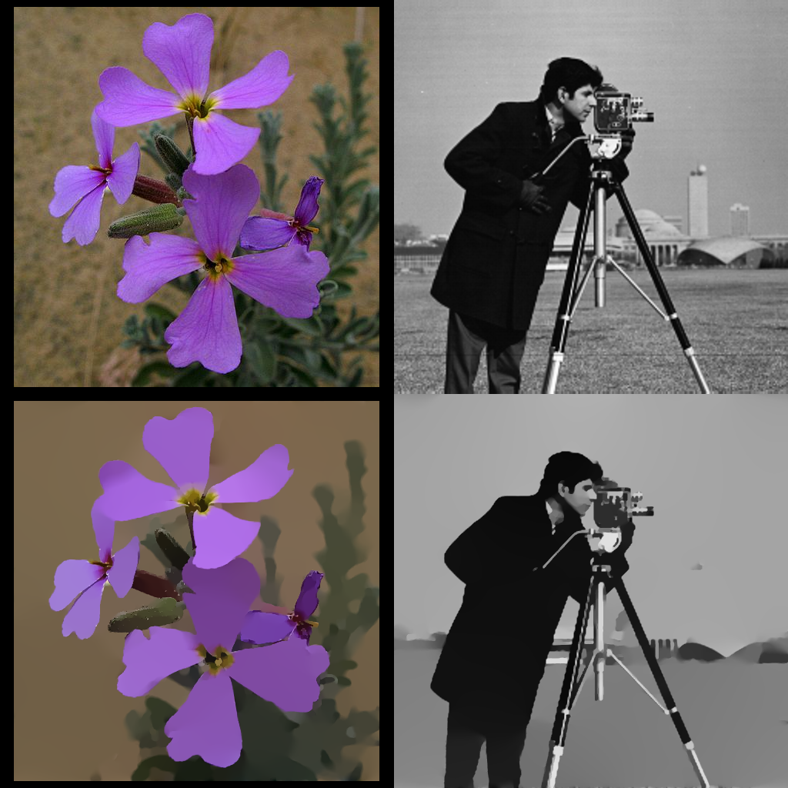

# Image-Smoothing-via-L0-Gradient-Minimization

### [Image Smoothing via L0 Gradient Minimization](http://www.cse.cuhk.edu.hk/leojia/projects/L0smoothing/index.html)
```julia
img = testimage("cameraman")
S = l0smoothing(img)
```
### Preview:

